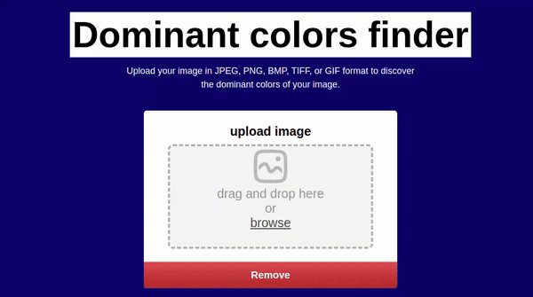

<h1>TLDR:</h1>

I made a web app that can find the top 3 main colors in an image using k-means algorithm. I implemented k-means on the server side. To reach a good level of accuracy, the algorithm does not use RGB, it uses cielab color space

 
