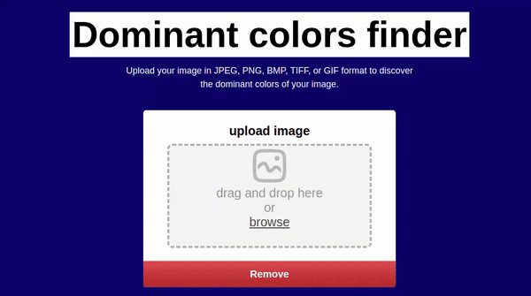
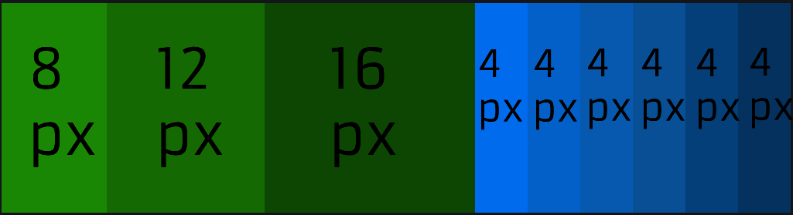
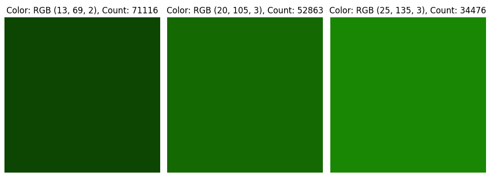
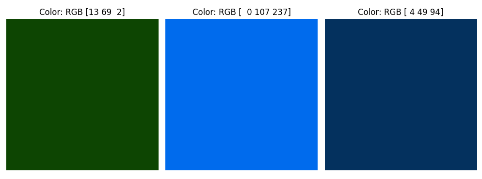

<h3>image dominant colors-web app</h3>
<h3>TLDR:</h3>

<strong>I made a web app that can find the 3 dominant colors in an image using k-means algorithm. 
  To reach a good level of accuracy, the algorithm does not use RGB, it uses CIELAB color space. 
   I implemented k-means on the server side.  
frontend: html,css,vanilla js 
backend: node.js,express and more 
examples: python 
</strong>

  

 

<strong>Get dominant colors of image:</strong>

To find the dominant colors of an image, we want a better method than just counting which color shows up the most.  why is counting colors naively not a good idea?
  
the problem is that in an image, you can have many different shades or versions of a single color. If we count them all separately, it would give us an inflated count.

For example:
  
If we naively count the dominant colors here, we might say there are three dominant colors and they are all a shade of green. And based on the count, they have 16 pixels, 12 pixels, and 8 pixels each. But here's the catch: all those different greens make up only 60% of the image, while the remaining 40% is blue. 
When we count colors naively, we're actually ignoring 40% of the image, and that doesn't make much sense in representing the colors accurately.

How can this be overcome?

We'll use K-Means algorithm to group similar colors so we don't end up counting too many versions of the same color. This way, we can accurately figure out which colors are the most dominant in the image.

If we return to our example,*without* using K-Means,If we look for the 3 dominant colors with naive counting we will get the colors:
 (python/naive_counting.py) 
But with the help of the algorithm we will get a better representation of the colors in the image: 
 (python/k_means.py) 
Remember that there are more shades of blue,each takes up a small amount of pixels, but in general there are more shades of blue than green.

